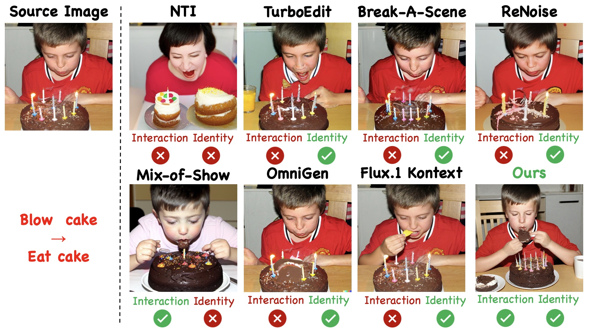

# Reference-free human-object interaction editing

[Jiun Tian Hoe](https://jiuntian.com/), 
[Weipeng Hu](https://scholar.google.com/citations?user=zo6ni_gAAAAJ), 
[Wei Zhou](https://scholar.google.com/citations?user=eyQteL0AAAAJ), 
[Chao Xie](https://scholar.google.com/citations?user=-W3ZltsAAAAJ),
[Ziwei Wang](https://ziweiwangthu.github.io/),
[Xudong Jiang](https://personal.ntu.edu.sg/exdjiang/),
[Yap-Peng Tan](https://personal.ntu.edu.sg/eyptan/),
[Chee Seng Chan](http://cs-chan.com)


[Project Page](https://jiuntian.github.io/interactedit) |
 [Paper](https://www.sciencedirect.com/science/article/abs/pii/S0925231226022678) |
 [arXiv](https://arxiv.org/abs/2503.09130) |
 [Code](app/) |
 [IEBench Dataset](https://huggingface.co/datasets/jiuntian/IEBench) |
 [IEBench-L Dataset](https://huggingface.co/datasets/jiuntian/IEBench-L)
 <!-- [paper]() -->
 <!-- [Demo](https://huggingface.co/spaces/interactdiffusion/interactdiffusion) | -->
  <!-- [Video](https://www.youtube.com/watch?v=Uunzufq8m6Y) | -->

[](https://www.sciencedirect.com/science/article/abs/pii/S0925231226022678)
[](https://arxiv.org/abs/2503.09130)
[](https://huggingface.co/datasets/jiuntian/IEBench)
[](https://huggingface.co/datasets/jiuntian/IEBench-L)
<!-- [](https://huggingface.co/spaces/interactdiffusion/interactdiffusion) -->

> TL;DR: We enables zero-shot human-object interaction edit

<sub>Previously available as a preprint titled "InteractEdit: Zero-Shot Editing of Human-Object Interactions in Images".</sub>



Sample results of editing Human-Object Interaction in the source image (left). Existing methods overly preserve the structure, making interaction edits ineffective.

- Existing methods overly preserve structural details from the source image, limiting their ability to accommodate the substantial non-rigid changes required for effective interaction edits.
- InteractEdit employs regularization techniques to constrain model updates, <b>preserving pretrained target interaction knowledge</b> and enabling <i>zero-shot interaction edits</i> while <b>maintaining identity consistency</b>.

## News

- **[2026.08.19]** InteractEdit is accepted in Neurocomputing.
- **[2026.02.25]** IEBench dataset is released on [Huggingface](https://huggingface.co/datasets/jiuntian/IEBench).
- **[2025.03.14]** InteractionEdit paper is released. Code will be released in future.


### Gallery


## Code

The implementation is in the [`app/`](app/) directory: [`pipeline.py`](app/pipeline.py) contains the
`InteractEditPipeline` (inversion/fine-tuning and editing), and [`app.py`](app/app.py) is the Gradio demo.

```bash
cd app
pip install -r requirements.txt
python app.py
```

## Diffusers
```python
from PIL import Image
from pipeline import InteractEditPipeline
import torch

# source image
image = Image.open("img_path.jpg")
sbj = "person"
obj = "ball"
# Fine-tune from source image, save in directory `sample-1`.
InteractEditPipeline.train(
    base_model="SG161222/RealVisXL_V5.0",
    output_dir="sample-1",
    image=image,
    sbj=sbj,
    obj=obj,
    initializer_tokens=[sbj, obj, "background"],
    # ... more hyperparameters in documentation
)
# Load fine-tuned model
pipeline = InteractEditPipeline.load_trained_pipeline(
    base_model = "SG161222/RealVisXL_V5.0",
    finetune_path = "sample-1",
).to("cuda", dtype=torch.float16)
# generate interaction edits 
images = pipeline(prompt="a person hold ball",
                   num_images_per_prompt=1,
                   generator=torch.Generator(device=pipeline.device).manual_seed(1234),
                   ).images

images[0].save('out.jpg')
```

## IEBench
IEBench dataset is released on Huggingface Dataset, as [jiuntian/IEBench](https://huggingface.co/datasets/jiuntian/IEBench),
and the larger IEBench-L as [jiuntian/IEBench-L](https://huggingface.co/datasets/jiuntian/IEBench-L).

## TODO

- [x] IEBench Release
- [x] Gradio demo
- [x] Diffuser code release

## Related Works
1. [[CVPR24] InteractDiffusion: Interaction-Control for Text-to-Image Diffusion Model](https://github.com/jiuntian/interactdiffusion)
2. [[CVPR26] OneHOI: Unifying Human-Object Interaction Generation and Editing](https://github.com/jiuntian/OneHOI)

## Citation

```bibtex
@article{HOE2026InteractEdit,
      title = {Reference-free human-object interaction editing},
      journal = {Neurocomputing},
      pages = {134869},
      year = {2026},
      issn = {0925-2312},
      doi = {https://doi.org/10.1016/j.neucom.2026.134869},
      url = {https://www.sciencedirect.com/science/article/pii/S0925231226022678},
      author = {Jiun Tian Hoe and Weipeng Hu and Wei Zhou and Chao Xie and Ziwei Wang and Xudong Jiang and Yap-Peng Tan and Chee Seng Chan},
}
@inproceedings{hoe2026onehoi,
  title={OneHOI: Unifying Human-Object Interaction Generation and Editing},
  author={Hoe, Jiun Tian and Hu, Weipeng and Jiang, Xudong and Tan, Yap-Peng and Chan, Chee Seng},
  booktitle={Proceedings of the IEEE/CVF Conference on Computer Vision and Pattern Recognition (CVPR)},
  year={2026}
}
```

## Acknowledgement

This work is developed based on the codebase of [diffusers](https://github.com/huggingface/diffusers) and [break-a-scene](https://github.com/google/break-a-scene).
